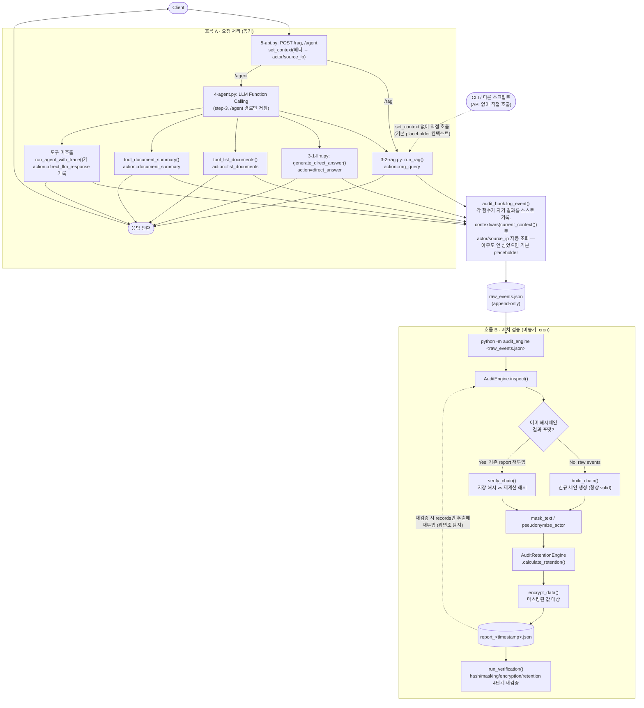

## 목표
RAG 시스템에 감사 엔진을 ADD-ON

## 파이프라인 개요

흐름 A(요청 처리)는 동기, 흐름 B(감사 검증)는 비동기 배치로 분리한다 — 근거는 step-2 구조 결정 참조.
흐름 A 안에서 감사 로깅이 API 계층이 아니라 RAG/Agent 함수 자신(SDK 계층) 안에 있다는 점이 이후
"감사 로깅 SDK 통일 리팩터"에서 바뀐 부분이다 — 아래 다이어그램은 그 이후 최종 구조.

`FormatCheck`의 "기존 report 재투입" 경로는 위변조 탐지 확인 방법이다 — `AuditEngine.save_report()` 산출물은
`{records:[...]}`로 감싸인 dict라 그대로는 재투입 불가하고, `records` 배열만 뽑아 별도 list 파일로
저장해야 `verify_chain()` 경로를 탄다([scenarios/run_audit_scenarios.py](Ch03/d06/scenarios/run_audit_scenarios.py)에서 검증 완료).

### step-1 : 관련 모듈 가져오기 (완료)
d06 에 d06/rag-agent : Ch01/d05의 rag-agent 부분
d06/audit_engine : Ch03/d05의 src/audit_engine

- rag-agent : 1-documents.py, 2-embeddings.py, 3-1-llm.py, 3-2-rag.py, 4-agent.py, 5-api.py, documents.txt
  (lab01~03 취약 챗봇 실습 파일은 별도 주제로 판단하여 제외)
- audit_engine : Ch03/d05/src/audit_engine 전체 (해시체인 + 보관정책 + 암호화/마스킹 통합 점검 엔진)

### step-2 : 감사 이벤트 수집 · 검증 파이프라인 연동 (구현 완료)

**구조 결정 (트레이드오프)**

1. 검증 방식 — 비동기/배치 분리 채택.
   `AuditEngine.inspect()`는 스트리밍 append API가 없는 배치형 파사드로, 호출마다 로그 파일 전체를 읽어
   해시체인을 재계산한다(O(n)). 요청 경로에 동기로 물리면 로그가 누적될수록 응답 지연이 증가하고,
   감사 엔진 장애가 곧 RAG API 장애로 전이된다(SPOF). API는 raw event 적재만 담당하고, 해시체인 검증·
   리포트 생성은 별도 배치가 수행한다 — 대신 무결성 확정까지 수 초~수 분 지연(RPO>0)을 감수한다.

2. 수집 지점 — API 계층(5-api.py) 채택.
   AuditEvent 스키마의 actor/source_ip 필드가 HTTP 요청 컨텍스트와 자연스럽게 매핑된다.
   4-agent.py를 CLI로 단독 실행하는 경로(main())는 감사 범위 밖으로 둔다.

**구성 요소**

- [rag-agent/audit_hook.py](Ch03/d06/rag-agent/audit_hook.py) (구현 완료, 이후 "감사 로깅 SDK 통일
  리팩터"에서 재작성됨): `AuditEventClient`(파일 append 전담) + `log_event()`(contextvars 기반
  ambient 로깅 진입점) SDK. audit_engine 디렉터리를 d06 아래의 정규 패키지(언더스코어 이름)로 두고
  있어 `sys.path`에 d06을 추가한 뒤 `import audit_engine`으로 그냥 불러온다(아래 "audit_engine
  패키지 통일" 참고 — 처음엔 하이픈 이름(`audit-engine`)이라 importlib 경로 로딩 워크어라운드가
  필요했는데, 이후 언더스코어로 통일하며 제거했다).
- [rag-agent/5-api.py](Ch03/d06/rag-agent/5-api.py) (구현 완료, 이후 재작성됨): `/rag`, `/agent`에
  `X-Actor`/`X-Role`/`X-Department` 헤더 파라미터를 받아 `audit_hook.set_context()`로 요청 컨텍스트만
  심어준다. **실제 로깅 호출은 더 이상 여기 없다** — "감사 로깅 SDK 통일 리팩터" 이후 RAG/Agent 함수
  자신이 스스로 기록한다. 이 문단의 "BackgroundTasks로 기록" 서술과 아래 "구현 중 발견한 이슈" 1번은
  리팩터 이전 상태의 기록으로 남겨두되, 최종 구조는 그 아래 새 절 참고.
- 배치 실행: `audit_engine/__main__.py`를 그대로 CLI로 쓴다 — `python -m audit_engine <log_file>`을
  cron/주기 작업으로 돌린다. (처음엔 디렉터리명이 하이픈이라 이 명령 자체가 불가능해서 importlib
  래퍼가 필요했었는데, "audit_engine 패키지 통일" 이후 표준 `-m` 실행이 그대로 된다 — 실제로
  재검증함.)
- 저장 경로: `d06/outputs/raw_events/rag_agent_events.json` (append 대상),
  `d06/outputs/audit_engine/report_<timestamp>.json` (배치 산출물).

**AuditEvent 필드 매핑**

| 필드 | 값 |
|---|---|
| actor | `X-Actor` 헤더, 없으면 `"anonymous"` |
| role | `X-Role` 헤더, 없으면 `"user"` |
| department | `X-Department` 헤더, 없으면 `"unknown"` |
| action | 각 함수가 자기 자신을 가리키는 literal 문자열로 직접 지정(`run_rag`→`rag_query`, `generate_direct_answer`→`direct_answer`, `tool_list_documents`→`list_documents`, `tool_document_summary`→`document_summary`, 도구 미호출→`direct_llm_response`) — 리팩터 이전엔 tool_name→action 매핑 함수(`map_action`)가 있었으나 로깅이 각 함수 내부로 옮겨가며 불필요해져 제거함 |
| asset | `"rag-agent"` 고정 |
| record_id | 요청별 UUID4 |
| source_ip | `request.client.host` |
| purpose | 질문 텍스트(길이 제한) |
| result | `"success"` / `"failure"` |

인증 시스템이 없는 데모 범위이므로 actor/role/department는 헤더 기반 placeholder다.

**미해결 항목**

- `audit_engine_config.json`의 `retention_policy.policies` 키(auth_login, export_pii, grant_role 등)는
  RAG 도구 action과 불일치 → 신규 action은 `default_policy`(365일)로 폴백된다. RAG 전용 보관정책 항목을
  추가할지는 별도 결정 필요(현재는 default 폴백 유지로 진행).
- raw events 파일은 계속 누적되므로 배치가 매번 파일 전체를 재빌드한다. 데모 규모에서는 허용하나,
  운영 규모로 확장 시 날짜별 파일 롤링이 필요하다.
- ~~동시 요청 시 raw events 파일 append에 대한 파일 락 처리 필요.~~ → 구현 완료, 아래 참고.

**구현 중 발견한 이슈 (둘 다 실제 테스트로 잡아냄, 코드 리뷰만으론 안 보였을 문제)**

1. **FastAPI `BackgroundTasks`는 예외 경로에서 실행되지 않는다.** `finally` 블록에서
   `background_tasks.add_task(...)`를 호출해도, 엔드포인트가 예외를 던지면 FastAPI의 예외 핸들러가
   별도 Response를 새로 만들어 반환한다 — 그 Response에는 우리가 채운 `BackgroundTasks` 인스턴스가
   붙지 않으므로 등록한 태스크가 통째로 버려진다. `/rag`, `/agent`에서 API 키 없이 500을 반환하는
   케이스를 실제로 호출해봤을 때 raw_events.json에 아무것도 안 남는 걸 보고 발견했다.
   **조치**: 실패 경로는 `log_audit_event(...)`를 예외 처리 블록 안에서 직접(동기) 호출하고,
   `BackgroundTasks`는 성공 응답 경로에만 쓴다. 실패 요청은 어차피 이미 느린 경로라 동기 기록의
   지연 비용이 무시할 만하다 — "동기 검증 금지" 원칙(위 구조 결정 1번)은 해시체인 재계산처럼 무거운
   연산에 대한 것이지, 단순 파일 append 자체를 금지하는 게 아니다.
2. **`fcntl.flock` 해제 전에 `flush`를 안 하면 동시 쓰기가 유실된다.** 락을 잡고
   read-modify-write까지는 맞게 짰는데, `json.dump()` 직후 바로 `fcntl.flock(f, LOCK_UN)`을 부르니
   `TextIOWrapper`의 버퍼에 남아있던 쓰기 내용이 아직 파일에 반영되기 전에 락이 풀렸다. 그 틈에
   다음 스레드가 락을 잡고 "옛 내용"을 읽어 자기 이벤트만 append한 뒤 덮어써서, 먼저 쓴 이벤트가
   사라졌다. 30개 스레드로 동시 append 재현 시 30건 중 17건이 유실됐다(에러 없이 조용히 사라짐 —
   가장 위험한 유형의 버그). **조치**: `json.dump()` 뒤에 `f.flush()` + `os.fsync(f.fileno())`를
   추가해 언락 전에 반드시 디스크에 반영되도록 고침. 재현 스크립트로 재검증: 30개 스레드 동시
   append → 30건 전부 유실 없이 기록, record_id 중복 없음(PASS).

### 감사 시나리오 검증 (완료)

step-2/3 설계의 전제(정책 미매핑 시 default 폴백, 마스킹 4종 탐지, 해시체인 위변조 탐지)를
실제 audit_engine 파이프라인으로 검증했다. 구현 착수 전 어셈블리 자체가 동작하는지 먼저 확인하는 단계.

- 수정: `audit_engine/__main__.py`의 `base_dir` 계산이 옛 구조(`d05/src/audit_engine`, 3단계 상위)
  기준이었던 것을 현재 평탄화된 구조(`d06/audit_engine`, 2단계 상위)에 맞게 고침. 안 고치면 config/output
  경로가 `Ch03/`으로 잘못 잡힌다.
- 신규: [configs/audit_engine_config.json](Ch03/d06/configs/audit_engine_config.json) — Ch03/d05 설정을 그대로 복사(정책 내용 변경 없음).
- 신규: [scenarios/rag_audit_events.json](Ch03/d06/scenarios/rag_audit_events.json) — RAG 에이전트 형태의 감사 이벤트 8건
  (마스킹 email/phone/name/card 각 1건, 실패 결과 1건, 신규 action 2종(`rag_query`/`direct_llm_response`)의
  default 폴백 확인, 기존 enterprise 정책(`export_pii`, 730일)과의 대조 1건).
- 신규: [scenarios/run_audit_scenarios.py](Ch03/d06/scenarios/run_audit_scenarios.py) — (당시엔 importlib로
  audit_engine을 로드했으나, 이후 "audit_engine 패키지 통일"에서 일반 import로 단순화됨) 8개 시나리오를
  `inspect()` + `run_verification()`에 통과시키고 기대값과 대조, 이어서 해시체인 결과를 조작해 위변조
  탐지까지 확인.

**결과**: 8개 시나리오 전부 PASS, 4단계 파이프라인 재검증(hash_chain/masking/encryption/retention) 전부 PASS,
위변조 탐지(entry #3 조작) PASS.

**발견 사항**: masking.py의 문맥 기반 이름 탐지 규칙(`(2~4자 한글)+고객`)이 "주말에 고객"의 "주말에"를
이름으로 오탐(false positive)했다 — 이름과 무관한 일반 명사도 "고객" 앞에 오면 걸린다. masking.py 자체
docstring에 "간이 규칙"으로 명시된 한계이므로 엔진을 고치지 않았음. rag-agent 실사용 시 짧은 순우리말 단어가
"고객"과 함께 오면 과탐 가능성이 있다는 점을 감안해야 한다.

### step-3 : 에이전트 도구 선택 — 규칙 기반 → LLM Function Calling(SDK) 전환 (구현 완료)

**중요 발견 (구현 착수 시점)**: `google.generativeai`를 실제로 import하면
`FutureWarning: All support for the google.generativeai package has ended. It will no longer be
receiving updates or bug fixes. Please switch to the google.genai package as soon as possible.`가
뜬다 — Google이 공식적으로 지원 종료를 선언한 상태다. "저장소 전역에서 이미 이 SDK만 쓴다"는
근거로 유지를 결정했었는데, 그 SDK 자체가 유지보수 종료라 이 근거의 무게가 줄었다. 다만 동작은
여전히 하고(`GenerativeModel(tools=[...])`, `start_chat(enable_automatic_function_calling=True)`
모두 정상 동작 확인), 신규 통합 SDK(`google-genai`)로의 전환은 이 파일 하나가 아니라 저장소 전역
영향이라 여전히 범위 밖으로 분리한다. **후속 결정 필요 항목으로 남김** — 당장 구현을 막을 사안은
아니라고 판단해 원래 결정대로 진행함.

**SDK 선택**: 기존 `google.generativeai`(legacy) 유지, 신규 의존성 도입 없음.
근거 — 저장소 전역(Ch01/Ch02/Ch03)에서 이미 이 SDK만 사용 중이고, function/tool calling을 자체 지원한다.
신규 통합 SDK(`google-genai`)로의 전환은 이 파일 한 곳의 문제가 아니라 저장소 전역 마이그레이션이므로
범위 밖으로 분리한다.

**변경 대상**: `4-agent.py`의 `choose_action()` 키워드 매칭 라우팅을 제거하고 LLM이 도구를 직접 선택하게 한다.

1. 기존 도구 함수 4개(`tool_list_documents`, `tool_document_summary`, `tool_rag`, `tool_direct_answer`)는
   시그니처 변경 없이 그대로 callable로 재사용 가능(`tool_rag`/`tool_direct_answer`는 `question: str`,
   나머지 둘은 무인자).
2. `model.start_chat(enable_automatic_function_calling=True)`로 세션을 열고, `GenerativeModel(tools=[...])`에
   위 4개 함수를 그대로 전달 — automatic function calling이 도구 선택·실행·결과 반영을 담당.
3. `run_agent_with_trace()`는 `chat.send_message(question)` 결과와 `chat.history`를 조회해
   실제 호출된 함수(`function_call` 파트)를 역추적, 기존 반환 스키마의 `tool_name`에 채운다.
   도구를 하나도 호출하지 않고 모델이 직접 답한 경우 `tool_name = "direct_llm_response"`로 표기
   (기존 4개 값과 구분되는 5번째 값).
4. `reason` 필드: 모델의 실제 추론 과정은 API로 노출되지 않으므로 규칙 문자열 대신 고정 텍스트
   (`"LLM function-calling 결정"`)로 대체하거나 필드 자체를 제거한다.

**step-2(감사 파이프라인)와의 접점**

- `audit_hook.py`의 action 매핑표는 `tool_name` 문자열 기준이므로 함수명이 유지되는 한 그대로 쓴다.
  다만 신규 값 `direct_llm_response` 매핑 1건 추가 필요.
- 적용 순서 권장: **step-3을 먼저 끝낸 뒤 step-2의 API 미들웨어를 붙인다.** `tool_name` 값 집합이
  step-3에서 확정되므로, 감사 action 매핑표를 두 번 고치지 않으려면 이 순서가 낫다.

**리스크/트레이드오프**

- 비결정성: 동일 질문에도 모델이 다른 도구를 고르거나 도구 없이 직접 답할 수 있음 — 규칙 기반 대비
  재현성이 떨어진다. 데모 목적에서는 허용 범위이나, 회귀 테스트에서 "도구 선택 자체"를 assert하기 어려워짐.
- 호출 비용/지연 증가: automatic function calling은 도구 선택 1회 + 도구 결과 반영 최종 응답 1회로
  최소 2회 모델 호출을 수행한다 — 규칙 기반 대비 지연·비용이 늘어난다.
- 실패 모드: 모델이 `tool_rag`의 `top_k` 같은 옵션 인자를 누락하거나 잘못된 인자로 호출하면 SDK가
  예외를 던진다. `5-api.py`의 `translate_error()`가 이 예외를 500으로 적절히 변환하는지 별도 확인 필요.

**구현 체크리스트**

- [x] `tool_list_documents`/`tool_document_summary`/`tool_rag`/`tool_direct_answer` 4개 함수에
      function-calling 스키마 추론용 docstring(Args 포함) 보강 후 `GenerativeModel(tools=[...])`에 전달.
- [x] `run_agent_with_trace()`를 `chat.start_chat(enable_automatic_function_calling=True)` 기반으로 재작성.
- [x] `chat.history`에서 `function_call` 파트를 역추적해 `tool_name` 채우는 로직 구현
      (`part.function_call.name`이 proto 기본값 빈 문자열이라는 점을 실제 객체로 사전 확인),
      도구 미호출 시 `tool_name = "direct_llm_response"` 처리.
- [x] `choose_action()` 및 규칙 기반 키워드 목록 제거 확인(grep으로 잔존 코드 없음 확인).
- [x] `5-api.py`의 `/agent` 엔드포인트가 바뀐 `run_agent_with_trace()` 반환 스키마와 호환 확인.

**잔여 위험**

설계 단계에서 받아들이기로 한 트레이드오프(위 리스크/트레이드오프 항목)와 별개로, 실제 구현 전까지는
아직 결정하지 않은 것들:

- ~~**GEMINI_API_KEY 의존성**: 성공 경로(실제 답변 생성) 미검증.~~ → **해소**. 실 API 키로 재검증
  완료 — step-4 "실 API 키로 성공 경로 검증" 참고. `/rag` 완전 성공, `/agent` 도구 선택 4종 정확,
  그 과정에서 새 버그(도구 미실행 상태의 send_message 실패가 감사 공백을 만드는 문제)를 찾아 고쳤다.
- automatic function calling 실패 시 폴백 부재: SDK가 함수 호출에 실패(인자 누락/오류)했을 때
  재시도 없이 바로 예외로 전파할지, 아니면 `tool_direct_answer`로 폴백할지 미정. (여전히 미결정)
- 회귀 테스트 불가능 영역: "질문 X는 반드시 도구 Y를 쓴다"는 assert가 비결정적 모델 출력 때문에
  깨지기 쉬움 — 실제로 동일 질문("비행기 표 환불 규정 알려줘")을 재시도했을 때 한 번은 SDK 레벨
  오류로 실패, 한 번은 성공한 사례를 실측했다(step-4 참고) — 비결정성이 이론이 아니라 실측된
  리스크임을 확인. (여전히 미결정)
- `google.generativeai` 지원 종료(위 "중요 발견" 참고) — 언제 `google-genai`로 옮길지는 별도 결정.

### audit_engine 패키지 통일 (완료)

처음(step-1)에 audit_engine을 `rag-agent`와 이름 스타일을 맞추려고 하이픈 디렉터리명
(`audit-engine`)으로 가져왔는데, 그 대가로 일반 `import`도 `python -m audit_engine`도 안 되는
워크어라운드(importlib 경로 로딩)가 코드 전반(`audit_hook.py`, `run_audit_scenarios.py`,
`audit_engine/__main__.py`의 base_dir 계산 등)에 깔려 있었다. "SDK로 통일"이라는 요청의 취지를
다시 짚어보면, 에이전트 쪽만 진짜 SDK(`google.generativeai`)를 쓰고 audit_engine 쪽은 워크어라운드로
남아있는 게 일관성이 없다는 지적이었다 — 그래서 audit_engine도 정규 패키지로 바꿨다.

**변경 내용**:

- `audit-engine/` → `audit_engine/` 디렉터리명 변경(`git mv`로 이력 보존).
- [rag-agent/audit_hook.py](Ch03/d06/rag-agent/audit_hook.py): importlib `spec_from_file_location` 로딩 로직 제거,
  `sys.path`에 d06 추가 후 `import audit_engine`으로 대체 — 코드 30줄 가량 삭제.
- [scenarios/run_audit_scenarios.py](Ch03/d06/scenarios/run_audit_scenarios.py): 동일하게 단순화.
- [audit_engine/__main__.py](Ch03/d06/audit_engine/__main__.py): base_dir 계산 로직 자체는 디렉터리 깊이 문제라
  이름 변경과 무관하게 그대로 유지(주석만 갱신).

**재검증**: 이름 변경 후 세 스크립트 전부 재실행 — [scenarios/run_audit_scenarios.py](Ch03/d06/scenarios/run_audit_scenarios.py)
8개 시나리오 PASS, [scenarios/test_api_audit_flow.py](Ch03/d06/scenarios/test_api_audit_flow.py) PASS,
`python3 -m py_compile`로 문법 확인. 그리고 처음엔 안 됐던 `python -m audit_engine <log_file>` CLI
실행이 이제 정상 동작함을 직접 확인(`AuditEngineConfigLoader`/`AuditEngine`/`run_verification` 전부
정상 로드, 리포트 저장까지 완료).

### 감사 로깅 SDK 통일 리팩터 (완료)

**문제 제기**: step-2에서 "수집 지점 = API 계층"을 정한 근거(HTTP 요청 컨텍스트에 actor/source_ip가
있다)는 여전히 맞다. 그런데 실제 코드는 그 근거를 "로깅 호출 자체를 5-api.py 라우트 안에 둔다"로
구현해버렸다 — 그 결과 감사가 HTTP API를 거치는 경로에서만 동작했다(CLI로 `python3 4-agent.py`를
직접 돌리면 감사가 전혀 안 남았다, step-2에 "CLI 경로는 감사 범위 밖"이라고 명시적으로 적어뒀던 그대로).
에이전트 도구 선택은 진짜 외부 SDK(`google.generativeai`)를 쓰는데 감사 쪽만 API 라우트에 결합돼
있는 게 비일관적이라는 지적을 받고, 로깅 호출 자체를 RAG/Agent 함수(SDK 계층) 안으로 옮겼다.

**핵심 아이디어 — "수집 지점"과 "로깅 구현 위치"는 다른 결정이다.**
"HTTP 컨텍스트가 필요하다"는 사실은 안 바뀐다. 다만 그 컨텍스트를 API 라우트가 직접 파일에 쓰는 데
쓰지 않고, contextvars로 심어두기만 하면(`audit_hook.set_context()`), 몇 단계 아래에서 실행되는
`run_rag()`/`generate_direct_answer()`/`tool_*()` 함수가 `audit_hook.log_event()`를 부를 때 자동으로
그 컨텍스트를 읽어간다. API가 컨텍스트를 "제공"할 뿐, 로깅 자체는 SDK 계층 함수 자신의 책임이 된다.
이건 OpenTelemetry/Sentry 같은 관측 SDK가 요청 컨텍스트를 전파하는 것과 같은 패턴이다.

**변경 내용**:

- [rag-agent/audit_hook.py](Ch03/d06/rag-agent/audit_hook.py): `AuditContext`(actor/role/department/source_ip)
  dataclass + `contextvars.ContextVar` 추가. `set_context()`/`reset_context()`/`current_context()`로
  컨텍스트 전파, `log_event(action, purpose, result)`로 현재 컨텍스트 기준 로깅. 이제 쓸모없어진
  `ACTION_MAP`/`AuditEventClient.map_action()`은 삭제(각 함수가 자기 action 값을 literal로 직접 씀).
- [rag-agent/3-2-rag.py](Ch03/d06/rag-agent/3-2-rag.py) `run_rag()`: 자기 실행 결과를 스스로
  `action="rag_query"`로 기록(성공/실패 둘 다).
- [rag-agent/3-1-llm.py](Ch03/d06/rag-agent/3-1-llm.py) `generate_direct_answer()`: 자기 실행 결과를
  `action="direct_answer"`로 기록.
- [rag-agent/4-agent.py](Ch03/d06/rag-agent/4-agent.py) `tool_list_documents()`/`tool_document_summary()`:
  무인자 도구라 원 질문 문구를 모르므로 purpose는 "무엇을 했는지" 서술하는 고정 문자열
  (`"문서 목록 조회"` 등)로 기록. `run_agent_with_trace()`는 두 경우만 자기 책임으로 기록한다 —
  (1) 도구 선택이 시작되기도 전에 실패(`require_gemini()` 등) → `action="unknown"`,
  (2) 도구가 하나도 호출되지 않음 → `action="direct_llm_response"`.
  **도구가 실행된 경우는 여기서 기록하지 않는다** — 그 도구(또는 도구가 위임하는 run_rag/
  generate_direct_answer)가 이미 자기 결과를 기록했으므로, 여기서 또 기록하면 요청 1건에 감사
  이벤트 2건이 남는 중복 기록 버그가 된다(설계 단계에서 인지하고 피함 — "책임 분담" 주석으로
  코드에도 남겨둠).
- [rag-agent/5-api.py](Ch03/d06/rag-agent/5-api.py): `BackgroundTasks`/`log_audit_event()`/`AUDIT_CLIENT`
  전부 제거. `/rag`, `/agent` 라우트는 이제 `audit_hook.set_context(...)` 로 컨텍스트만 심고
  `finally`에서 `reset_context()` 할 뿐, 로깅 호출이 코드에 없다.
  **부수 효과**: 이전 "구현 중 발견한 이슈" 1번(BackgroundTasks가 예외 경로에서 실행 안 되는 문제)이
  원천적으로 사라졌다 — BackgroundTasks 자체를 안 쓰니 그 프레임워크 제약에 더 이상 노출되지 않는다.
  대신 로깅이 항상 동기로 실행되는데, `AuditEventClient._append()`가 하는 일은 파일 락 + JSON append뿐
  (해시체인 계산 같은 무거운 연산은 여전히 별도 배치의 몫)이라 지연 비용은 무시할 만하다는 판단.

**행동 변화 (의도적)**: CLI에서 `python3 4-agent.py`나 `python3 3-2-rag.py`를 직접 실행해도 이제
감사 로그가 남는다(actor="anonymous", source_ip="local" 같은 기본 placeholder로). step-2에서
"CLI 경로는 감사 범위 밖"이라고 정했던 것의 정정이다 — SDK 계층에 로깅이 내장된 이상, 호출 경로가
API든 CLI든 라이브러리를 쓰기만 하면 감사가 남는 게 자연스럽다.

**재검증**: [scenarios/test_api_audit_flow.py](Ch03/d06/scenarios/test_api_audit_flow.py)에 4번째 섹션을
추가해 "API를 전혀 거치지 않고 `run_rag()`를 직접 호출해도 감사가 남는지"를 실측 — `set_context()`를
아무도 안 불렀는데도 `actor="anonymous"`, `source_ip="local"` 기본값으로 정확히 1건 기록됨을 확인(PASS).
기존 1~3번 섹션(API 경유 흐름)도 재실행해 전부 PASS 유지 확인. 동시성 테스트(스레드 30개 동시
`log_event()` 호출)도 새 구조로 재실행해 유실/중복 없음 재확인(PASS).

**후속 수정**: 이 리팩터 직후엔 "도구가 실행되면 도구가, 안 됐으면 run_agent_with_trace가" 두 갈래로
책임을 나눴는데, 실 API 키로 테스트하다 세 번째 갈래(도구 실행 전에 `chat.send_message()` 자체가
실패)를 놓쳤던 게 드러났다 — 상세는 아래 step-4 "실 API 키로 성공 경로 검증" 참고, 수정은
`audit_hook.py`의 `begin_tracking()`/`was_logged()` 추적 플래그로 반영함.

### step-4 : rag-agent 및 audit_engine 통합 테스트 시나리오 (완료 — 실 API 키로 성공 경로까지 검증)

앞서 완료한 "감사 시나리오 검증"은 `AuditEvent`를 직접 구성해 audit_engine 파이프라인만 단독 검증한
것이다. step-4는 그 반대편 — 실제 `/rag`, `/agent` HTTP 호출(문서 임베딩·검색 경유)이 끝난 뒤
`audit_hook.py`가 진짜로 raw events 파일에 기록을 남기고, 그 파일이 배치 검증을 통과하는지 확인하는
end-to-end 테스트다.

**실행 결과** ([scenarios/test_api_audit_flow.py](Ch03/d06/scenarios/test_api_audit_flow.py)):

이 개발 환경에 `GEMINI_API_KEY`가 없어 **실패 경로만 검증했고, 성공 경로(실제 RAG 답변 생성)는
검증하지 못했다** — 아래 결과를 그런 전제로 읽을 것.

- `GET /health`, `/documents`, `/tools` (Gemini 불필요): PASS.
- `POST /rag`, `POST /agent`를 API 키 없이 호출 → 의도대로 500 반환, 그리고 그 실패가 감사 로그에
  `result="failure"`로 정확히 1건씩 기록됨(요청당 raw_events.json 엔트리 +1, 유실/중복 없음) — PASS.
  이 과정에서 "구현 중 발견한 이슈" 1번(BackgroundTasks 예외 미실행 버그)을 실제로 잡아냈다.
- 이렇게 쌓인 raw_events.json을 `AuditEngine.inspect()`에 통과 → hash_chain/masking/encryption/retention
  4단계 전부 PASS — 실제 API 호출 산출물도 audit_engine 파이프라인과 호환됨을 확인.
- `AuditEventClient` 동시 append 안전성: 스레드 30개로 직접 재현 → 유실/중복 없음 PASS
  (버그 발견 후 flush+fsync 수정 반영, "구현 중 발견한 이슈" 2번).

**실 API 키로 성공 경로 검증 (완료)**

사용자가 실제 `GEMINI_API_KEY`(`gemini-2.5-flash`)를 제공해 위에서 "API 키 필요"로 남겨뒀던 항목을
마저 검증했다. 키는 이번 세션의 셸 환경변수로만 썼고 어떤 파일에도 쓰거나 커밋하지 않았다 — 다만
대화창에 평문으로 전달됐으므로 세션 기록이 남는 환경이면 노출된 것으로 보고 재발급을 권고했다.

- `/rag` 완전 성공: 문서 3건 임베딩(`gemini-embedding`, 3072차원) → 코사인 유사도 검색(hit
  weather 0.7971) → 프롬프트 조립 → `gemini-2.5-flash` 응답 생성 → 200 OK, 정확한 답변("서울의
  여름 날씨는 대체로 덥고 습하며...") — PASS.
- `/agent` 도구 선택 정확도: `문서 목록 보여줘`→`tool_list_documents`, `문서 구성 요약해줘`→
  `tool_document_summary`, `파이썬은 어떤 언어야?`→`tool_direct_answer`, `비행기 표 환불 규정
  알려줘`(재시도)→`tool_rag` — 4종 전부 LLM이 스스로 올바른 도구를 골랐다(규칙 기반 없이) — PASS.
- **실제 API 키로 테스트하다가 새 버그를 하나 더 발견**: `chat.send_message()` 자체가 어떤 도구도
  호출하지 못한 채 실패하는 경우(실측: 임베딩 API 분당 쿼터 초과 429, 그리고 별도로 레거시
  `google.generativeai` SDK에서 `KeyError: 'rag'`가 한 번 재현 — 동일 질문 재시도 시 정상 성공,
  SDK 자체의 산발적 불안정으로 판단, 이 SDK가 지원 종료 상태라는 점과 일치하는 정황)가 실제로
  발생했는데, 이 경우 어떤 도구도 `log_event()`를 호출한 적이 없어 감사 공백이 생겼다(요청은
  실패했는데 감사 로그엔 아무 기록도 안 남음). **조치**: `audit_hook.py`에 `begin_tracking()`/
  `was_logged()`/`end_tracking()` 추적 플래그 추가, `run_agent_with_trace()`가 `chat.send_message()`를
  감싸서 "누구도 기록 안 했으면" 폴백으로 `action="unknown"`을 기록하도록 수정(도구가 이미 기록한
  경우와 구분해 중복 기록은 안 함). 수정 후 재현 케이스로 재검증: `retry_tester`의 실패가
  `action="unknown"`으로 정확히 1건 기록됨을 확인 — PASS.
- CLI/직접 호출 성공 경로도 실제 확인: `4-agent.py`를 API 없이 직접 실행해 같은 질문을 다시 보내니
  `actor="anonymous"`로 `rag_query`/`success`가 정확히 기록됨 — "감사 로깅 SDK 통일 리팩터"에서
  주장한 "API 없이도 감사가 남는다"가 성공 경로에서도 성립함을 실측으로 확인.
- 마스킹 오탐 재현: 실제 API 응답이 섞인 데이터를 배치(`python -m audit_engine`)에 통과시키니
  이전에 발견했던 "주말에"→이름 오탐(masking.py의 간이 규칙 한계, "감사 시나리오 검증" 절 참고)이
  실제 트래픽에서도 그대로 재현됨 — 알려진 한계이지 새 버그 아님, 실사용 시 유의사항으로 재확인.
- 배치 파이프라인(`python -m audit_engine`, 성공/실패 섞인 실제 5건): hash_chain/masking/encryption/
  retention 4단계 전부 PASS.

**조건 (아래는 위 검증에 실제로 쓴 절차 — 참고용으로 유지)**

1. 수동 테스트 방식
   - `uvicorn 5-api.py`로 API 기동 (`GEMINI_API_KEY` 필요 — [잔여 위험] 항목 참조).
   - `curl`로 `/rag`, `/agent` 엔드포인트에 더미 질문을 순차 호출, 매 호출마다
     `X-Actor`/`X-Role`/`X-Department` 헤더를 다르게 넣어 필드 매핑을 함께 확인.
   - 호출 종료 후 `outputs/raw_events/rag_agent_events.json`에 요청 수만큼 엔트리가 append됐는지 확인.
   - `scenarios/run_audit_scenarios.py`와 같은 방식으로 이 raw events 파일을 `AuditEngine.inspect()`에
     통과시켜 해시체인/마스킹/암호화/보관정책 4단계가 실제 API 호출 결과에 대해서도 PASS하는지 확인.

2. 테스트할 항목
   - 도구별 최소 1회 호출 → `tool_name`이 올바른 action 값으로 감사 로그에 남는지
     (`rag_query`/`direct_answer`/`list_documents`/`document_summary`/`direct_llm_response` 5종).
   - PII가 포함된 질문 → 감사 로그의 `masked_purpose`에 원본 PII가 남지 않는지
     (`scenarios/rag_audit_events.json`에서 이미 검증한 email/phone/name/card 4종을 실제 질문 문장으로 재사용).
   - `result = "failure"` 케이스: 존재하지 않는 문서 요청, LLM 오류(API 키 누락 등 강제 유발) 등
     실패 응답도 감사 로그에 남는지 — 현재 `audit_hook.py` 설계에 실패 케이스 훅이 없다면 이때 드러남.
   - 동시 요청 2건 이상을 병렬로 보내 raw events 파일이 깨지지 않는지(step-2 미해결 항목의 파일 락
     이슈를 여기서 실증).
   - 배치 스크립트를 두 번 연속 실행했을 때(중간에 새 요청 없이) 두 번째 실행의 해시체인이 첫 번째와
     동일하게 valid로 나오는지(멱등성 확인).

3. 테스트할 더미데이터
   - RAG 코퍼스는 기존 `documents.txt`(weather/product 등 기존 문서) 그대로 사용 — 새 문서 추가 불필요.
   - 질문 더미셋은 `4-agent.py main()`의 5개 예시 질문(문서 목록/구성 요약/고객 지원/날씨/일반 질문)에
     `scenarios/rag_audit_events.json`에서 쓴 PII 포함 질문 4종(이메일/전화번호/이름/카드번호 문맥)을
     더해 총 9개 내외로 구성. 이렇게 하면 "감사 시나리오 검증" 단계에서 이미 검증한 마스킹 기대값을
     그대로 재사용해 대조할 수 있다.

4. RAG 임베딩 동작 시 감사로그 발생 확인
   - 목적: `tool_rag`가 실제로 문서 임베딩(2-embeddings.py) → 벡터 검색(3-2-rag.py) → LLM 응답까지
     전체 파이프라인을 타는 경로에서 `audit_hook.append_event()`가 누락 없이 호출되는지가 이 테스트의
     핵심 확인 대상이다(단순 함수 호출 성공/실패가 아니라 "부수효과로 감사 로그가 실제로 생겼는가").
   - 확인 방법: `/rag` 호출 전후로 `raw_events.json`의 라인 수(또는 이벤트 개수)를 비교 — 호출 1회당
     정확히 1개 증가해야 한다. 증가하지 않으면 audit_hook 연동 누락, 2개 이상 증가하면 중복 기록 버그.